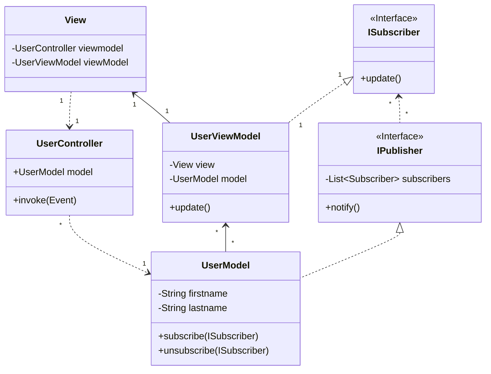

# Clean-Desktop-UI
CS 346 sample, demonstrating MVVM and clean architecture.

* **Dependencies**: flow from View (top) to Model (bottom).
* **Data flow**: notifications flow bottom to top via interfaces.

